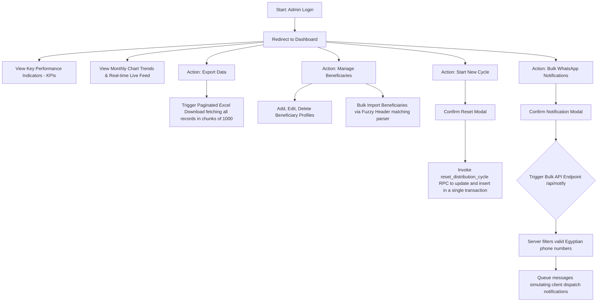
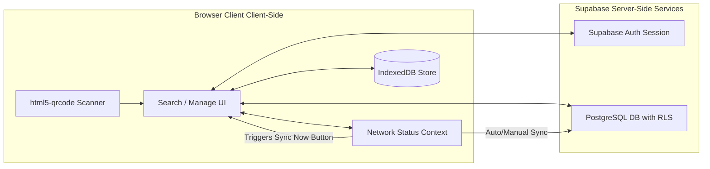

# System Documentation & Gap Analysis Report

**Project:** Charity Aid Distribution Management System  
**Auditor:** Expert System Architect, QA Lead, and UX/UI Specialist  
**Last Updated:** June 13, 2026  
**Language/Locale:** Arabic (RTL) & English  

---

## 1. App Route & Component Tree Map

The application follows the Next.js App Router pattern, structured around a protected authenticated route group `(auth)` and public authentication routes. Below is the folder structure and component mapping:

```text
app/
├── globals.css                       # Global styling & Tailwind directives
├── layout.tsx                        # Root Server Layout (Arabic RTL & Cairo Font config)
├── page.tsx                          # Root Page (Auto-redirects to /dashboard or /login)
├── error.tsx                         # Global Error Boundary (Client)
├── not-found.tsx                     # Global Arabic 404 Page (Client)
│
├── login/                            # 🔓 Public Authentication Route
│   ├── page.tsx                      # Server Page: Login Route Entry
│   └── _components/
│       └── login-form.tsx            # Client Component: Supabase Email/Password Auth
│
├── api/
│   └── notify/                       # ⚙️ Bulk WhatsApp API Endpoint
│       ├── route.ts                  # Route Handler: POST endpoint with environment secret validation
│       └── __tests__/
│           └── route.test.ts         # Vitest: Endpoint unit tests (Auth & validation checks)
│
└── (auth)/                           # 🔒 Protected Route Group (Authenticated Sessions Only)
    ├── layout.tsx                    # Server Layout: Authenticated Session Gate
    ├── _components/
    │   └── auth-header.tsx           # Client Component: Navigation bar, Network Indicator & Manual Sync Now Button
    │
    ├── dashboard/                    # 📊 Admin Dashboard Route
    │   ├── page.tsx                  # Server Page: Aggregates KPIs & fetches optimized recent feed
    │   └── _components/
    │       ├── dashboard-actions.tsx # Client Component: Paginated Excel Export, WhatsApp Notification Trigger & Stored Procedure (RPC) Cycle Reset
    │       ├── live-feed.tsx         # Client Component: Real-time scrolling transaction history
    │       ├── monthly-chart.tsx     # Client Component: Chart logic container
    │       └── monthly-chart-dynamic.tsx # Client Component: Recharts dynamically imported wrapper
    │
    ├── search/                       # 🔍 Cashier Search & Disbursement
    │   ├── page.tsx                  # Server Page: Search Container
    │   └── _components/
    │       ├── search-interface.tsx  # Client Component: Debounced query, Optimistic UI, IndexedDB queue bridge
    │       └── qr-scanner-modal.tsx  # Client Component: html5-qrcode video feed scanner modal with camera permission recovery and retry button
    │
    └── beneficiary/
        └── [id]/                     # 👤 Beneficiary Profile Detail
            ├── page.tsx              # Server Page: Stats Engine, WhatsApp URI Generator
            └── _components/
                ├── transactions-list.tsx # Client Component: History list with Framer Motion
                └── qr-card.tsx       # Client Component: Generates and prints QR Code
```

---

## 2. Comprehensive User Journey Map

### 2.1. The Cashier User Journey
```mermaid
graph TD
    A[Start: Cashier Login] --> B(Enter Email & Password)
    B --> C{Authentication Status}
    C -- Failed --> D[Display Error Alert]
    C -- Success --> E[Redirect to Search Interface]
    
    E --> F[Network status: Active or Offline]
    
    F --> G1[Option A: Scan Beneficiary QR Code]
    F --> G2[Option B: Manual Input Name / National ID]
    
    G1 --> H[Open Camera Scanner Modal]
    H --> I{Permission status?}
    I -- Blocked --> I1[Show Arabic Instructions & "Retry" Button]
    I1 -- Grant & Retry --> H
    I -- Allowed --> J[Scan QR Code & Extract Beneficiary ID]
    
    G2 --> K[Query Beneficiary Record]
    J --> K
    
    K --> L{Already received aid in current cycle?}
    L -- Yes --> M[Show Red Alert / Disable Disbursement Button]
    L -- No --> N[Show Green Success Banner / Show "Confirm Disbursement"]
    
    N --> O[Click Confirm Disbursement]
    O --> P[Open Confirmation Dialog]
    P --> Q[Click Submit]
    
    Q --> R{Network Status}
    R -- Online --> S[Direct Supabase Postgres write]
    R -- Offline --> T[Store in Local IndexedDB & Optimistic UI Update]
    
    S --> U[Show Success Toast / Clear Confirmation State]
    T --> U
```

### 2.2. The Administrator User Journey


---

## 3. System Architecture & Feature Explanation

The application coordinates four main structural modules to ensure secure data handling, fast performance, and high offline durability:



*   **Supabase Auth Session Management:** Enforces security policies at the route level via Next.js Middleware and at the database level. User sessions are verified on every page load.
*   **PostgreSQL with Row-Level Security (RLS):** RLS is enabled on all tables (`beneficiaries`, `aid_transactions`, `distribution_cycles`). Insert operations for aid transactions check the caller identity against `auth.uid() = admin_id` to prevent session spoofing. Unique indexes enforce the single distribution rule per cycle.
*   **IndexedDB Offline Cache:** When the internet connection goes down, transactions are captured locally inside the browser's `IndexedDB` (`offline_transactions` store). Optimistic UI states instantly mask the network failure for the cashier. 
*   **Synchronization Engine:** Supports automatic sync on reconnection and manual sync via the `Sync Now` button in the header. The sync engine catches Postgres unique index violation errors (`23505`), treating them as success (since the transaction already exists on the server) and deletes them from IndexedDB to avoid blocking subsequent updates.
*   **Camera Permission Recovery:** The QR scanner modal explicitly handles permission errors, displaying detailed Arabic guides and offering a `Retry` button that triggers camera reinitialization.

---

## 4. CRITICAL GAP ANALYSIS & MISSING LOGIC

While many gaps have been addressed in the recent refinements, several structural items must be planned for a production-ready system.

### 4.1. Entirely Missing Features

1.  **No Role-Based Access Control (RBAC):**
    *   *Issue:* Currently, any authenticated user can access the `/dashboard` route, delete beneficiaries, reset cycles, and export reports. There is no distinction between "Cashier" (who only needs search/disburse features) and "Manager/Admin".
    *   *Risk:* Cashiers could accidentally trigger a cycle reset or modify beneficiary data, causing campaign disruption.
2.  **No Audit Logging for Administrative Actions:**
    *   *Issue:* Administrative actions (e.g. cycle resets, bulk beneficiary imports, deletions) are performed without leaving a history log.
    *   *Risk:* Changes to cycle states or beneficiary data cannot be traced back to the staff member who initiated them.

### 4.2. Incomplete Existing Features & Logic Flaws

1.  **Silent Resolution of Offline Queue Collisions:**
    *   *Issue:* When duplicate transactions are skipped during sync (Postgres unique constraint violation `23505`), the record is successfully deleted from IndexedDB to clear the queue. However, the cashier who recorded that duplicate transaction has no UI warning that their save was skipped as a duplicate.
    *   *Risk:* Discrepancies between cashier records and database data remain hidden.
2.  **No Beneficiary Profile Modification Verification:**
    *   *Issue:* In the beneficiary management interface, updating a profile does not verify changes or require approvals, allowing immediate edits to sensitive fields (e.g. name or family size).
    *   *Risk:* Potential data manipulation or human error during fast-paced distribution cycles.

### 4.3. Security & Performance

1.  **IndexedDB Session Expiry Handling:**
    *   *Issue:* If a user session expires while the cashier is offline, transactions are still successfully saved to IndexedDB. However, upon reconnecting, the sync attempts will fail due to authentication rejection (401/403 status).
    *   *Risk:* Cached offline transactions cannot be synced until the user logs back in, and logging back in might delete or refresh the local environment if not handled properly.
2.  **Database Connection Pool Exhaustion under Load:**
    *   *Issue:* When multiple cashiers trigger bulk offline sync simultaneously, a spike in connections can temporarily saturate the database connection limit.
    *   *Risk:* Temporary database lockouts and slow query response rates for other active cashiers.
